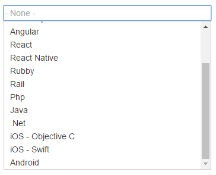
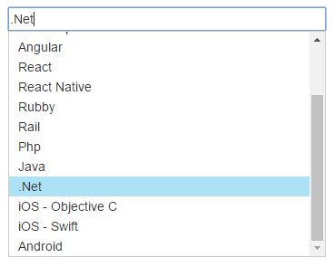

# plain-combobox
Simple plain combobox work neat and clean for ONLY string data type. No filteting

# bower
`bower install plain-combobox`

# Intergration

```
angular.module('myApp', ['pCombobox'])

<p-combobox placeholder="- None -" 
options="data source as array of string" 
selected="model.value" 
on-selected="events.change" 
css-class="my-class"
input-format="^(0?[1-9]|1[0-2]):[0-5][0-9] (AM|PM)$"
</p-combobox>
```
Properties other than `options` & `selected` are optional.

# Demo
Download the repository and open `index.html` inside `demo` folder

# Quick look and feel



# Road map
* Add support for object type
* Add filter
